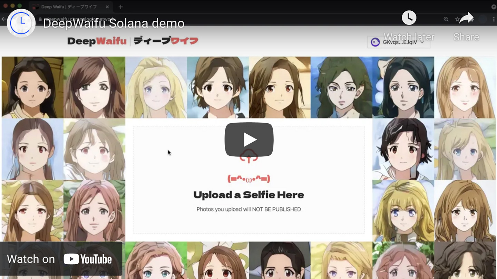

# deep-waifu-server-astar

This is a part of the [DeepWaifu](https://blog.chronologic.network/no-waifu-no-laifu-we-use-deep-networks-to-draw-your-anime-style-portrait-5fbb0ee6b16a) project.

This repository holds the server code that handles the following responsibilities:

- proxy requests for converting selfies into waifus
- mint waifus as NFTs
- handle pillow purchases

The live version of the dapp can be found [here](https://deepwaifu.ai/).

## 🗺 Project overview

This project consists of the following repositories:

- https://github.com/chronologic/deep-waifu-ui-astar
- https://github.com/chronologic/deep-waifu-server-astar (this repository)
- https://github.com/chronologic/deep-waifu-nft-astar
- https://github.com/chronologic/deep-waifu-model

## 👀 Demo video

## 🔧 Environment variables

This repo uses [`dotenv`](https://www.npmjs.com/package/dotenv) to load environment variables.

For development, an `.env` file should be created based on the `.env.example` template file. The `.env` file should never be commited.

In production, environment variables can be injected directly.

Below is a list of possible environment variables.

| Name                   | Type     | Default | Description                                                                                    |
| ---------------------- | -------- | ------- | ---------------------------------------------------------------------------------------------- |
| `LOG_LEVEL`            | `string` | `info`  | Standard [`npm`](https://github.com/winstonjs/winston#logging-levels) log level                |
| `PORT`                 | `number` | `1337`  | Port at which the server should be listening                                                   |
| `SELF_URL`             | `string` |         | Public URL to this server. This is used for constructing a redirect after purchasing a pillow. |
| `UI_URL`               | `string` |         | URL of [DeepWaifu UI](https://github.com/chronologic/deep-waifu-ui-astar)                      |
| `MODEL_URL`            | `string` |         | URL of [DeepWaifu AI Model](https://github.com/chronologic/deep-waifu-model)                   |
| `NETWORK_URL`          | `string` |         | Network the server should connect to.                                                          |
| `NFT_CONTRACT_ADDRESS` | `string` |         | Address of [DeepWaifu NFT Contract](https://github.com/chronologic/deep-waifu-nft-astar)       |
| `WALLET_PK`            | `string` |         | Signer private key. This wallet will be used for minting the NFTs.                             |

| `PINATA_API_KEY` | `string` | | API key for [Pinata](https://pinata.cloud) IPFS storage service. |
| `PINATA_SECRET_KEY` | `string` | | Secret key for [Pinata](https://pinata.cloud) IPFS storage service. |
| `STRIPE_PUBLIC_KEY` | `string` | | Public API key for [Stripe](https://stripe.com/docs/api/authentication) payment service. This is used in the pillow purchase flow. |
| `STRIPE_SECRET_KEY` | `string` | | Secret API key for [Stripe](https://stripe.com/docs/api/authentication) payment service. This is used in the pillow purchase flow. |
| `PILLOW_PRICE_USD` | `number` | | The price of the pillow in USD. |
| `IMGBB_KEY` | `string` | | API key for [imgbb](https://api.imgbb.com/) image storage service. This is used for temporary storage of images in the pillow purchase flow. |
| `PRINTFUL_KEY` | `string` | | API key for [Printful](https://www.printful.com/api) on-demand printing service. This is used for the pillow purchase flow. |

## 💽 Installation

Run `npm install`

## 🚧 Building

Run `npm run build`

## 👷 Development

Run `npm run dev`
